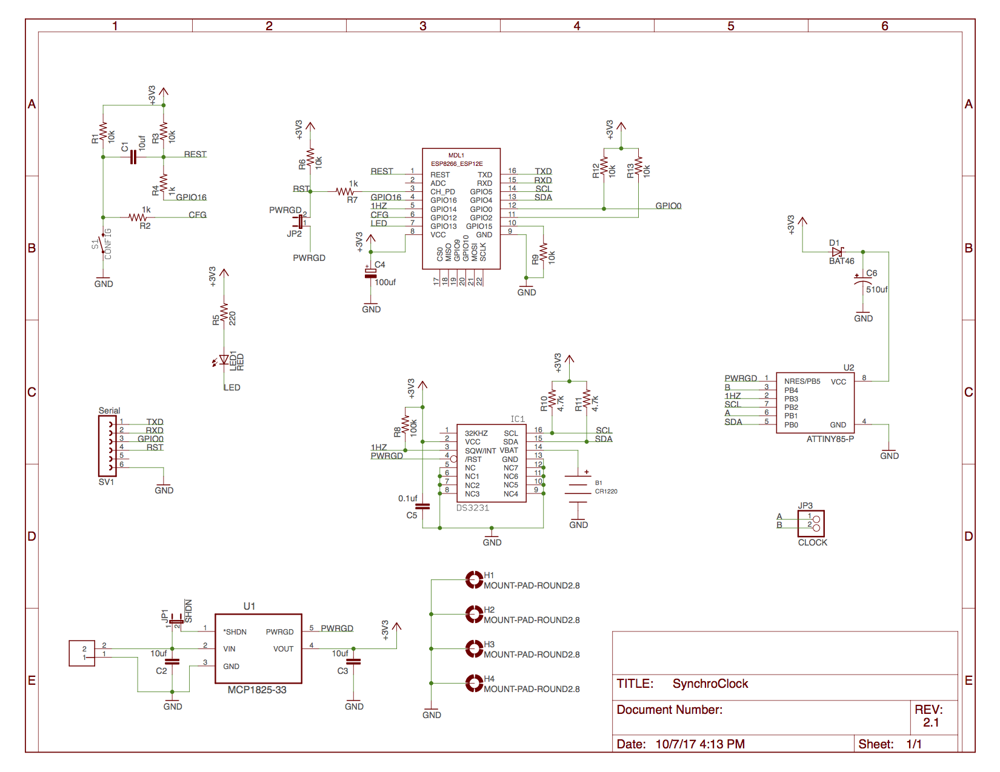

# AnalogClock
Project to sync analog clocks to a few milliseconds using NTP for time synchronization.

Its a work in progress - more documentation coming soon-ish.

[I2CAnalogClock](I2CAnalogClock) contains the code for the ATTiny85 as an I2C based Analog Clock controller.  I used [Eclipse with an Arduino plugin](http://sloeber.io) for development.  If you want to use the Arduino IDE then create an empty file named I2CAnalogClock.ino.

[SynchroClock](SynchroClock) contains the code for the ESP8266 module.   I used [Eclipse with an Arduino plugin](http://sloeber.io) for development.  If you want to use the Arduino IDE then create an empty file named SynchroClock.ino.

[NTPTest](NTPTest) contains a framework for testing the NTP class in an accelerated manor on linux or MacOS saving days of waiting for results.

[eagle](eagle) contains the [Eagle](https://www.autodesk.com/products/eagle/overview) design files.

## Arduino Board Requirements
* [I2CAnalogClock](I2CAnalogClock) uses ATTiny85 from [ATTinyCore](https://github.com/SpenceKonde/ATTinyCore) configured as internal 8mhz clock. Note that this uses the reset pin as an output and requires the RSTDISBL fuse bit be cleared after programming for proper operation.
* [SynchroClock](SynchroClock) uses the 'NodeMCU 1.0 (ESP-12E Module)' from [ESP8266 core for Arduino](https://github.com/esp8266/Arduino) configured for 80mhz

## Arduino Library Requirements
* [WiFiManager](https://github.com/tzapu/WiFiManager) - by default WiFiManager only supports 10 extra fields on the configuration page. This project uses close to 30!  If my [pull request](https://github.com/tzapu/WiFiManager/pull/374) has not been merged then you will need to use my [fork](https://github.com/liebman/WiFiManager).

* [USIWire](https://github.com/puuu/USIWire) - This is the only i2c client implementation that worked properly with an ATTiny85 using its internal 8mhz clock.

## Configuration
   When the clock is initially powered on it creates a wifi captive portal.  It will show up in the list of available wifi networks as SynchroClockXXXXXXX (where the X’s are some number).  Configuration mode can be forced by holding down the reset button until the LED is flashing at a fast rate then releasing it. When you connect to this you are given a menu that lets you set many configuration options:
* Wifi Network (SSID)
* Wifi Network password
* Timezone as offset in seconds from UTC
* Clock Position - enter the current time shown on the clock as HH:MM:SS - this can be left blank if the clock is already running.
* NTP Server to sync with
* 1st time change as 5 fields (US/Pacific would be: 2 0 3 2 -25200 meaning the second Sunday in March at 2am we change to UTC-7 hours)
    * occurrence - 2 would be the second occurrence of the day of week specified, -1 would be the last one.
    * day of week - where 0 = Sunday
    * month - where 1 = January
    * hour - where 0 = midnight
    * time offset - this is the offset in seconds from UTC
* 2nd time change as 5 fields as described above (US/Pacific: 1 0 11 2 -28800 meaning the first Sunday in November at 2am we change to UTC-8 hours)

Advanced options:
* Stay Awake - when set true the ESP8266 will not use deep sleep and will run a small web servers allowing various operations to be performed with an http interface.
* Tick Pulse - this is the duration in milliseconds of the “tick”.
* Adjust Pulse - this is the duration in milliseconds of the “tick” used to advance the clock rapidly.
* Adjust Delay - this is the delay in milliseconds between “ticks” when advancing the clock rapidly.
* Sleep Delay - this is the delay in  milliseconds after completion of a “tick pulse” before sleeping the DRV8838.
* Network Logger Host - (optional) hostname to send log lines to.
* Network Logger Port - (optional) tcp port to send log lines to.
* Clear NTP Persist - when set 'true' clears any saved adjustments and drift calculations.

## Schematic

